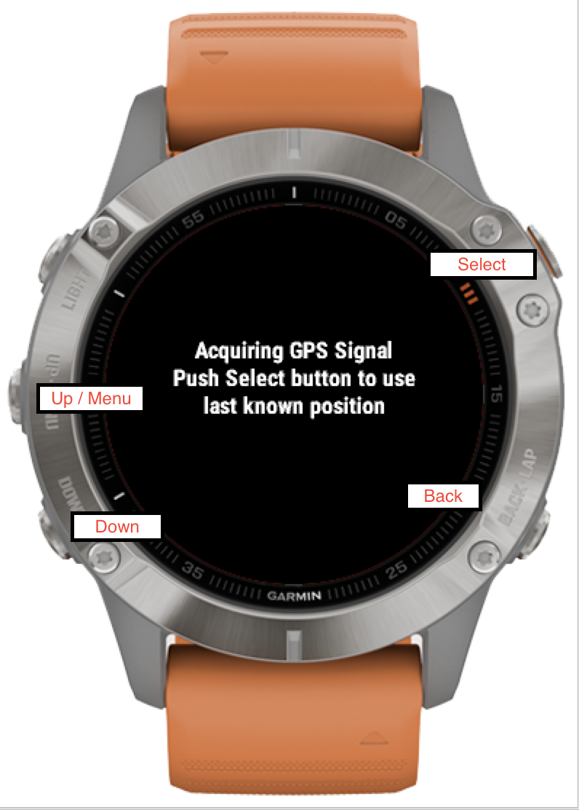
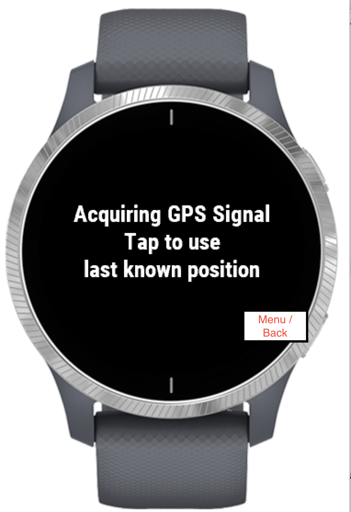
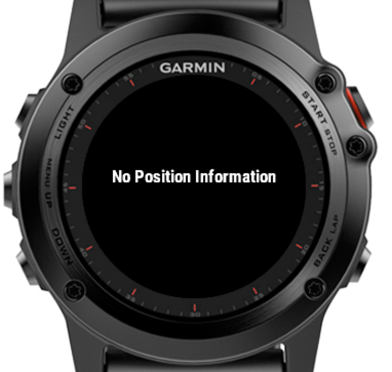
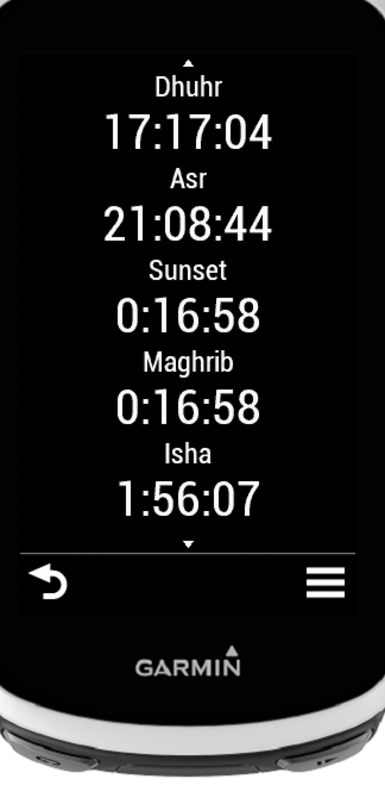
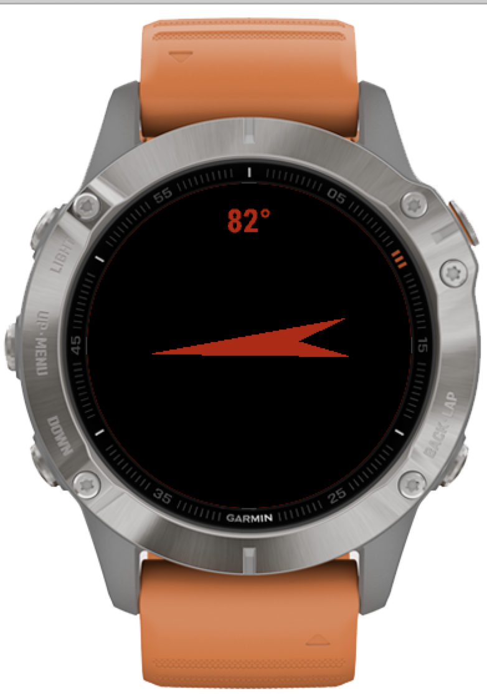

# Instructions for Islamic Prayer Times Widget for Garmin Devices

© Slipperybee

App Version 4.0.0

## Functions
- Shows the following times:
	- Fajr
	- Dhuhr
	- Sunrise
	- Asr
	- Sunset
	- Maghrib
	- Isha
- Compass to Makkah
- Calculation Methods
	- Ithna Ashari
	- University of Islamic Sciences, Karachi
	- Islamic Society of North America (ISNA)
	- Muslim World League (MWL)
	- Umm al-Qura, Makkah
	- Egyptian General Authority of Survey
	- Institute of Geophysics, University of Tehran
- Juristic Methods
	- Shafii
	- Hanafi
- Adjusting Methods for Higher Latitudes
	- No adjustment
	- Middle of night
	- 1/7th of night
	- Angle/60th of night
- Choose Date
- Prayer Time Alarm (on supported devices only)

## General Usage
Depending on your device the "Up", "Down", "Select" and "Menu" buttons or functions are different.  This depends on whether the device is touch or how many buttons it has.  Here are some examples:

### Non-touch watch

__To access the menu the *up* button needs to be pressed and held__

### Touch Watch

__To access the menu press the *back* button and hold.  Up and down is down through swiping.  To select *tap* the screen__

### Other Devices
See your manual to see how other devices use the menu depending on touch or not.

## Functionality
### Getting position information
When you first access the widget it needs to be updated with your position.  Therefore you should start the widget outside or at least near a window that has good access to the GPS satellites.  
If you have already updated the position you can press "Select" (or tap) to load the position.  If you do this and no position has been saved the widget will display an error message:

### Viewing the times
Once the widget has successfully obtained your position it will display the times.  This is displayed as a scrollable list that can be scrolled using up and down (buttons or swipe).  It will by default display the next time (either at the top for rectangular devices or in the middle for watches).

In this case you will have to restart the widget outside

Here the next time is at the top

Here the next time is in the middle of the scrollable list

### Compass to Makkah
To view the compass press the *Select* button or tap - according to your device type.  This will open the compass view.

 

The compass bearing refers to the direction of Makkah.  When you near the correct direction the arrow will turn green.

Press the *back* button to return to the main times list

### Menu
Press the *menu* button (depending on your device).  Using the menu depends on the type of device that you have.  There are a number of choices you can make:

## Salah Alerts (on supported devices only)
By selecting this option you can set up the widget to give you a five minute warning before the next prayer time.  
__Important:__ Due to the way that Garmin has enabled alarms only the _next_ prayer time can be set at a time.  When the alert points up you will have to reopen the widget.  Once you reopen the widget the next alert will be set up. 

__Not all devices support this functionality__  If you don't have this menu option you will not be able to enable alerts.

## Calculation Method
Here you can choose the calculation method.  This option is saved for future sessions.

## Juristic Method
Here you can choose the Juristic method.  This option is saved for future sessions.

## Adjust HL Methods
Here you can adjust the calculation method for High Latitudes. This option is saved for future sessions.

## Choose Date
Here you can adjust the date to see the times.  Please note that this is not saved for future sessions.  When you open the widget again the date will be reset to the current date.

## Help
A simple help screen

## About
Information for debugging and support purposes

### Help and contact
You can contact the developers at the facebook page:
<https://www.facebook.com/Muslim-Prayer-Times-Widget-for-Garmin-Connect-IQ-249548012092383/timeline>

or by email at <contact@slipperybee.com>
